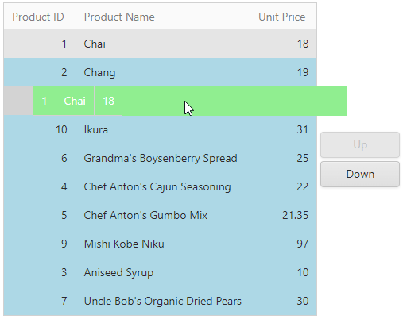

# Grid View for ASP.NET Web Forms - Reorder Grid Rows Using Buttons and Drag-and-Drop

<!-- run online -->
**[[Run Online]](https://codecentral.devexpress.com/128542189/)**
<!-- run online end -->

This example demonstrates how to use buttons and jQuery drag-and-drop functionality to reorder rows in [ASPxGridView](https://docs.devexpress.com/AspNet/DevExpress.Web.ASPxGridView).



Set up the grid and create an invisible column that stores row order indices. Sort the grid by this column and disable sorting at the control level.

```xml
<dx:ASPxGridView ID="gvProducts" runat="server" ...>
    <Columns>
        ...
        <dx:GridViewDataTextColumn FieldName="DisplayOrder" Visible="false" SortIndex="0"
            SortOrder="Ascending" />
    </Columns>
    <SettingsBehavior AllowSort="false" ... />
    ...
</dx:ASPxGridView>
```

When a user clicks the button or drags and drops a row, the grid sends a callback to the server, sets the invisible column value to a new row order index, and updates the grid data.

## Files to Look At

* [Default.aspx](./CS/Default.aspx) (VB: [Default.aspx](./VB/Default.aspx))
* [Default.aspx.cs](./CS/Default.aspx.cs) (VB: [Default.aspx.vb](./VB/Default.aspx.vb))

## Documentation

- [Draggable](https://jqueryui.com/draggable/)
- [Droppable](https://jqueryui.com/droppable/)
- [ASPxGridView.SettingsBehavior.AllowSort](https://docs.devexpress.com/AspNet/DevExpress.Web.ASPxGridBehaviorSettings.AllowSort)
- [GridViewDataColumn.SortIndex](https://docs.devexpress.com/AspNet/DevExpress.Web.GridViewDataColumn.SortIndex)
- [GridViewDataColumn.SortOrder](https://docs.devexpress.com/AspNet/DevExpress.Web.GridViewDataColumn.SortOrder)

## More Examples

- [Grid View for ASP.NET Web Forms - How to Use jQuery to Drag and Drop Items from One Grid to Another](https://github.com/DevExpress-Examples/how-to-use-jquery-to-drag-and-drop-items-from-one-aspxgridview-to-another-e1810)
- [TreeList for ASP.NET Web Forms - How to Reorder ASPxTreeList Sibling Nodes Using Buttons or Drag-and-Drop](https://github.com/DevExpress-Examples/how-to-reorder-aspxtreelist-sibling-nodes-using-buttons-or-drag-and-drop-e3850)
- [Grid View for ASP.NET Web Forms - How to Move Up or Down a Grid Row Using External Buttons](https://github.com/DevExpress-Examples/how-to-move-up-or-down-a-line-a-row-of-aspxgridview-by-using-external-buttons-e4299)
